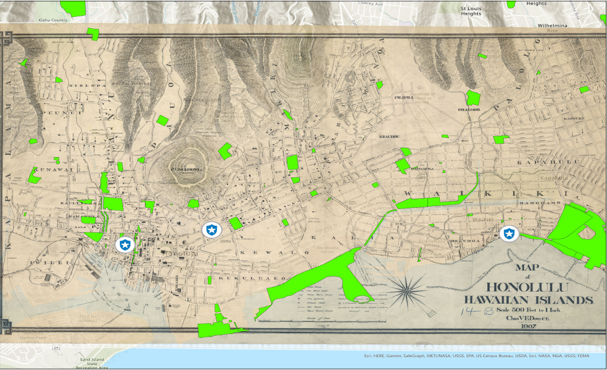
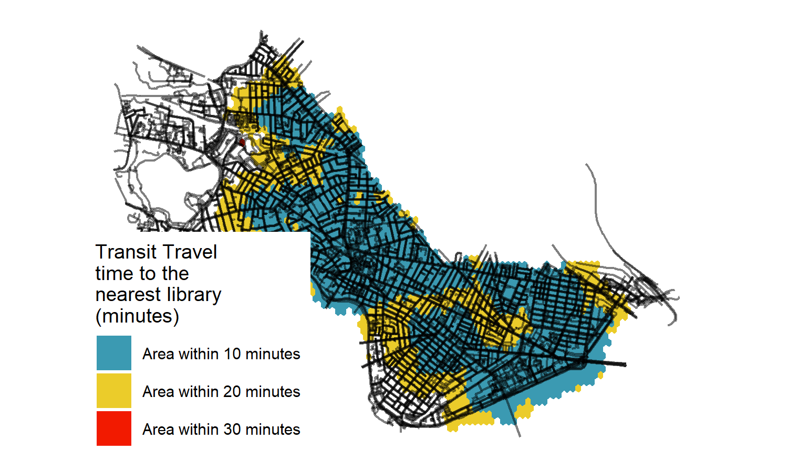
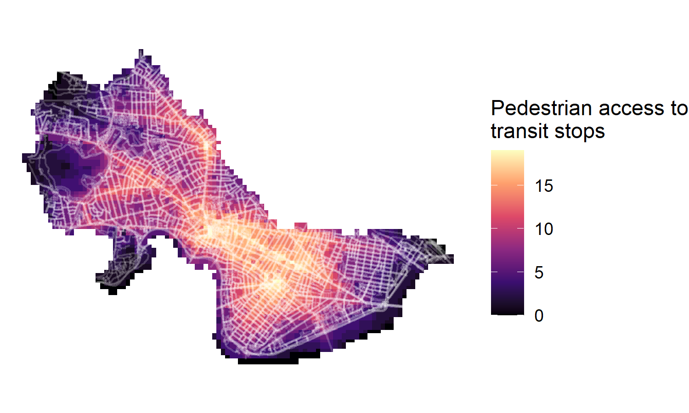
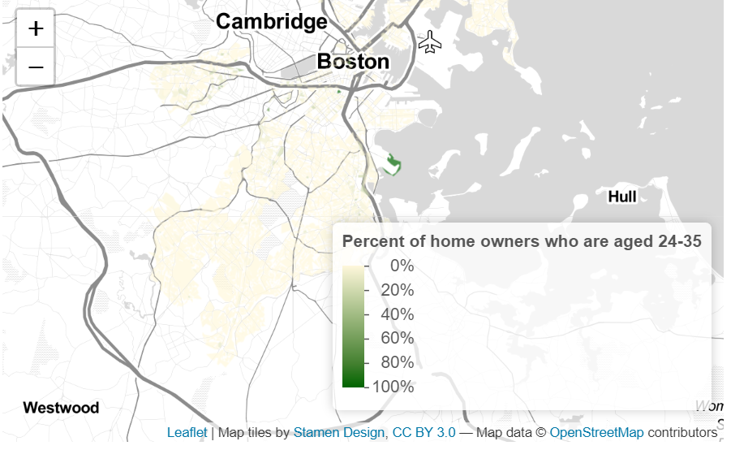

```{r setup, include=FALSE}
knitr::opts_chunk$set(echo = TRUE)
```

# Introduction

I am creating a portfolio learnt from skillsets in VIS 2128. I am using the Architect theme and I am trying to display the following skillsets

* Displaying multiple vector layers on the same map
* Calculating and displaying relationships among point and polygon layers based on distance
* Aggregating point data to a layer of polygons
* Calculating and displaying accessibility, based on travel time
* Converting between raster layers and vector layers
* Displaying raster data on a map
* Georeferencing a raster image
* Displaying data on an interactive map

# Spatial Portfolio

## Georeferencing
In this map, I tried to georeference a historical map of Hawaii, Honalulu in relation to the current day green spaces and police stations. This was because I wanted to understand the general safety levels of Honalulu, since it was a booming tourist spot.There were only 3 police stations and 91 green spaces.

It demonstrates the following skills:

*Georeferencing a raster image

[](https://clairetham1.github.io/Spatialportfolio//fullsize/georef2){target="_blank"}

## Map of San Francisco

In this map, I tried to find out the relationship of trees to parking stations in San Francisco.

It demonstrates the following skills:

*Calculating and displaying relationships among point and polygon layers based on distance

[](https://clairetham1.github.io/Spatialportfolio//fullsize/neighborhoods.pdf){target="_blank"}


## Maps of Cambridge

## Isochrones
This map shows isochrones based on transit travel times to the nearest library. It demonstrates the following skills:

* Displaying multiple vector layers on the same map
* Calculating and displaying accessibility, based on travel time

[](https://clairetham1.github.io/Spatialportfolio//fullsize/isochrones.pdf){target="_blank"}

## Accessibility
This map shows accessibility based on a distance-decay function of the walking time to the nearest transit stop. It demonstrates the following skills:

* Displaying multiple vector layers on the same map
* Calculating and displaying accessibility, based on travel time
* Displaying raster data on a map

[](https://clairetham1.github.io/Spatialportfolio//fullsize/cAM_street.pdf){target="_blank"}

## Interactive Map
This interactive map demonstrates the following skills: 

* Displaying data on an interactive map

I wanted to find out how many millennials (aged 24-35) owned homes in Boston. I was interested in this because of there were multiple newpaper and trending social media remarks highlighting it was difficult for youths to afford housing in Boston, due to stagnating wages and the lack of affordable housing. I decided to map this spatially. I could have improved on the map by introducing another layer of information on the income of millennials in order to gain more understanding on why there were very little millennials who owned houses.

[](https://clairetham1.github.io/Spatialportfolio//fullsize/inter_youngowner.html){target="_blank"}

At the back of the Covid-19 pandemic, I was interested to see how many people worked from home and how this was concentrated in locations spatially. I used ACS data and also utilised GTFS code to map out the transit stops to see if there was a relationship between transit stops and the work from home phenomenom. I was unable to find any spatial relationship, but nonetheless, found out that there was a work from home cluster around Fenway and East Fern Street.

I could have improved the map by introducing another layer of information on the income earned or the type of jobs people in such areas work in order to derive a more complete picture of why work from home clusters formed in those vicinities.

[](https://clairetham1.github.io/Spatialportfolio//fullsize/inter_transit4.html){target="_blank"}


