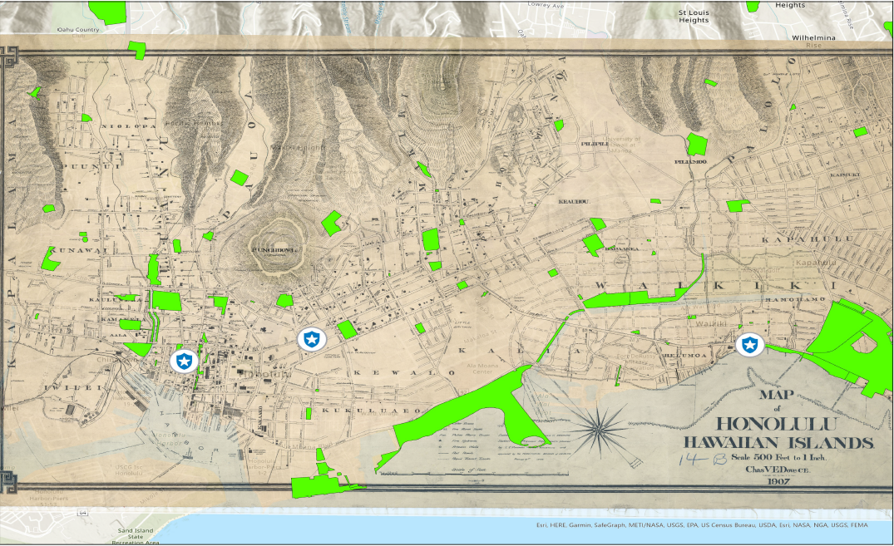
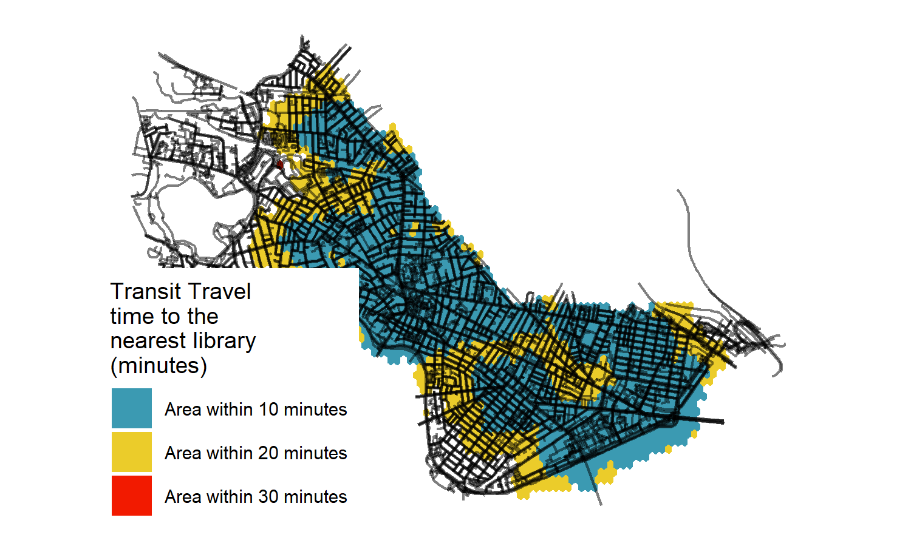
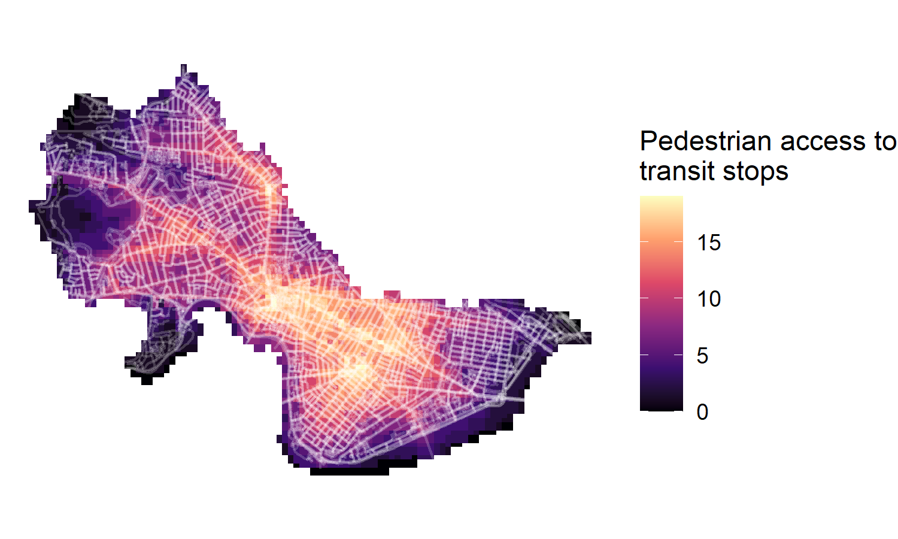
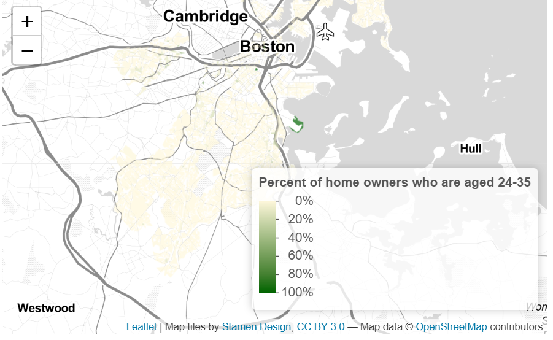
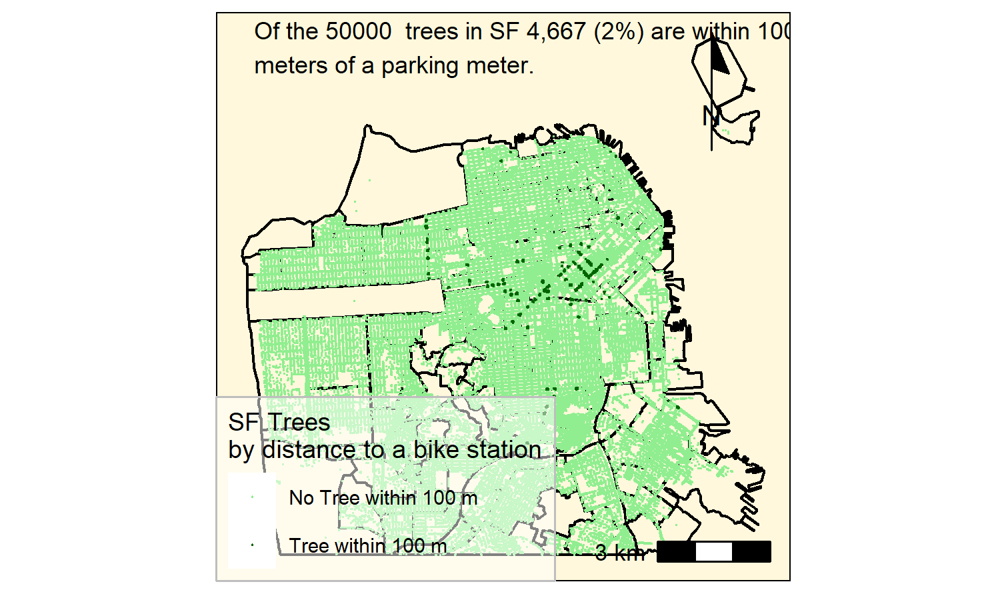

```{r setup, include=FALSE}
knitr::opts_chunk$set(echo = TRUE)
```

# Introduction

I am creating a portfolio learnt from skillsets in VIS 2128. I am using the materials theme and I am trying to display the following skillsets

* Displaying multiple vector layers on the same map
* Calculating and displaying relationships among point and polygon layers based on distance
* Aggregating point data to a layer of polygons
* Calculating and displaying accessibility, based on travel time
* Converting between raster layers and vector layers
* Displaying raster data on a map
* Georeferencing a raster image
* Displaying data on an interactive map

# Georeferencing
In this map, I tried to georeference a historical map of Hawaii, Honalulu in relation to the current day green spaces and police stations. This was because I wanted to understand the general safety levels of Honalulu, since it was a booming tourist spot.There were only 3 police stations and 91 green spaces.

It demonstrates the following skills:

*Georeferencing a raster image

[](https://clairetham1.github.io/Spatialportfolio//fullsize/georef2){target="_blank"}

#Maps of Cambridge

## Isochrones
This map shows isochrones based on transit travel times to the nearest library. It demonstrates the following skills:

* Displaying multiple vector layers on the same map
* Calculating and displaying accessibility, based on travel time

[](https://clairetham1.github.io/Spatialportfolio//fullsize/isochrones.pdf){target="_blank"}

## Accessibility
This map shows accessibility based on a distance-decay function of the walking time to the nearest transit stop. It demonstrates the following skills:

* Displaying multiple vector layers on the same map
* Calculating and displaying accessibility, based on travel time
* Displaying raster data on a map

[](https://clairetham1.github.io/Spatialportfolio//fullsize/cAM_street.pdf){target="_blank"}

## Interactive Map
This interactive map demonstrates the following skills: 

* Displaying data on an interactive map

[](https://clairetham1.github.io/Spatialportfolio//fullsize/inter_youngowner.html){target="_blank"}


## Clockboard Map
This map demonstrates the following skills:

* Aggregating point data to a layer of polygons

[](https://clairetham1.github.io/Spatialportfolio//fullsize/neighborhoods.pdf){target="_blank"}
